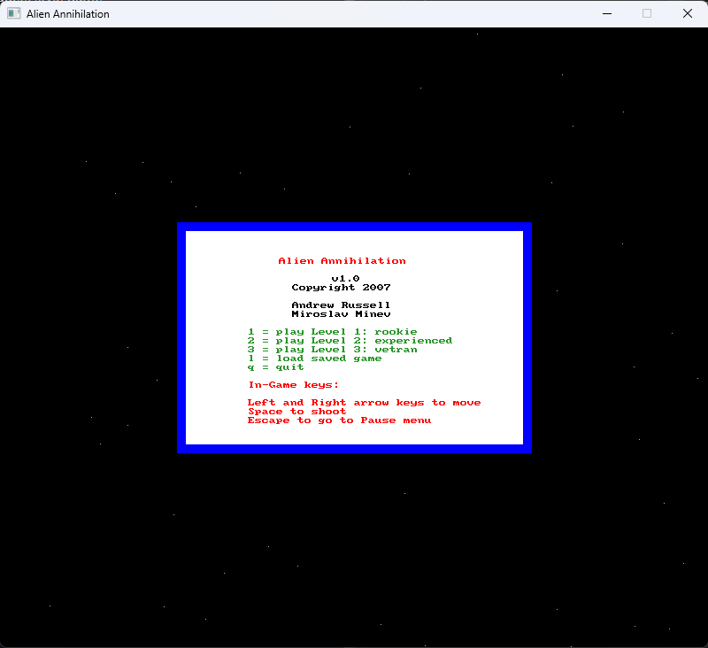
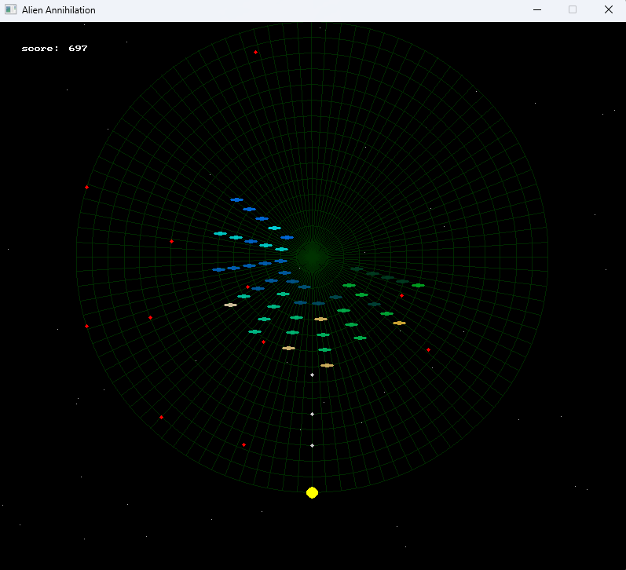
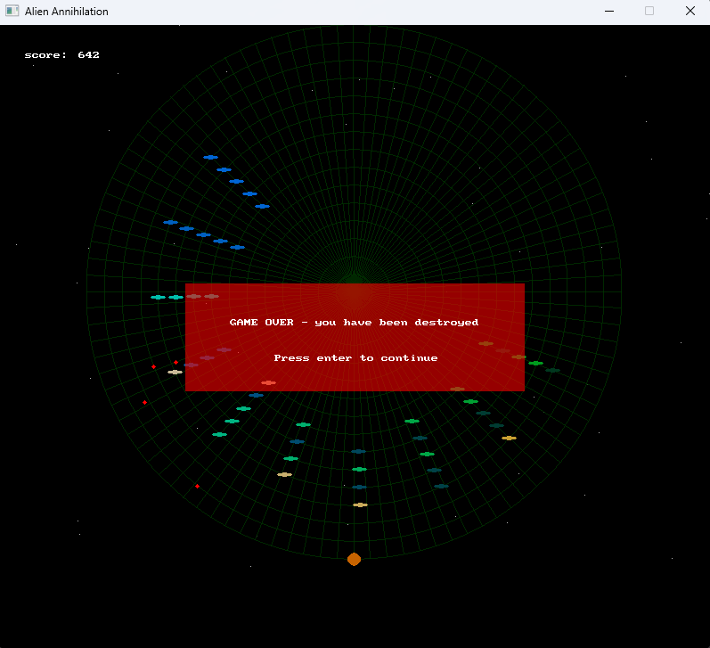

# Alien Annihilation

OOD project for ELEN3009 Software Development II course in 3rd year 2007, at the University of the Witwatersrand.







## Repo structure:

```
- alien-annihilation/       <- root solution folder
  - alien-annihilation/     <- project folder
  - Debug/                  <- build folder
  - docs/                   <- documentation
  - libs_backup/            <- dependencies (for build and run)
  - alien-annihilation.sln  <- Visual Studio solution file
```

## Setup on Windows

- Install Microsoft Visual Studio Community 2022.
- Open solution file and set build configuration to `x86` (32 bit), and configure depencies on `x86` libs (next step). I could only get `SDL2_gfx` to build for `x86` and not `x64`.
- `/libs_backup/vclib.zip` contains just the necessary library files copied from `/libs_backup/source`. This is needed to build the `alien-annihilation` project. Extract and copy this to anywhere e.g. `C:\vclib`, and configure the project settings in Visual Studio to point to these dependecies (see [Setting up SDL 2 on Visual Studio](https://lazyfoo.net/tutorials/SDL/01_hello_SDL/windows/msvc2019/index.php) for more info).
- important dll files: `SDL2.dll`, `SDL2_gfx.dll`, `SDL2_ttf.dll`
- important settings files: `settings1.txt`, `settings2.txt`, `settings3.txt`
- To run the game from Visual Studio, the dll and settings files need to be in the project folder e.g. `alien-annihilation/alien-annihilation`. These should already be there.
- To run the game using the executable e.g. `alien-annihilation/Debug/alien-annihilation.exe`, the dll and settings files need to be in the same folder as the `.exe` e.g. `alien-annihilation/Debug`. These should already be there.

## Libraries

`/libs_backup/source` folder contains the full source of each library. These are generally available to download from the internet. They are here as a backup (just in case).

- SDL
  - [info](https://www.libsdl.org) and [repo](https://github.com/libsdl-org/SDL)
  - source: `SDL2-devel-2.28.5-VC.zip` 
  - folders `include` and `lib` contain the dependencies needed for building the `alien-annihilation` project.
  - folder `include` has header files for `Include directories`
  - folder `lib` has binary files (`SDL2.lib` and `SDL2main.lib`) for `Library directories`
  - folder `lib` also has `SDL2.dll` needed for runtime.

- TTF
  - source: `SDL2_ttf-devel-2.20.2-VC.zip`
  - similar structure to SDL folder

- GFX 
  - source: `SDL2_gfx-1.0.4.gz`
  - source: `SDL2_gfx-1.0.4-build-x86.zip` - same as above but extracted, and solution built in Visual Studio, for 32-bit (`x86`) config. The outputs from the build are in the folder `/Win32/Debug`, most importantly `SDL2_gfx.lib` and `SDL2_gfx.dll`. The zip file has been manually renamed with `-build-x86` suffix (just as a label), so if extracting to run the build, the main folder `SDL2_gfx-1.0.4-build-x86` might need to be renamed to the original `SDL2_gfx-1.0.4`, but this is unconfirmed and untested.

## More info:

- [Setting up SDL 2 on Visual Studio](https://lazyfoo.net/tutorials/SDL/01_hello_SDL/windows/msvc2019/index.php)
- [Tutorial on Game Programming with SDL](https://lazyfoo.net/tutorials/SDL)
- [SDL 1 to 2 Migration Guide](https://wiki.libsdl.org/SDL2/MigrationGuide#Overview_of_new_features)
- [SDL release archive](https://www.libsdl.org/release)
